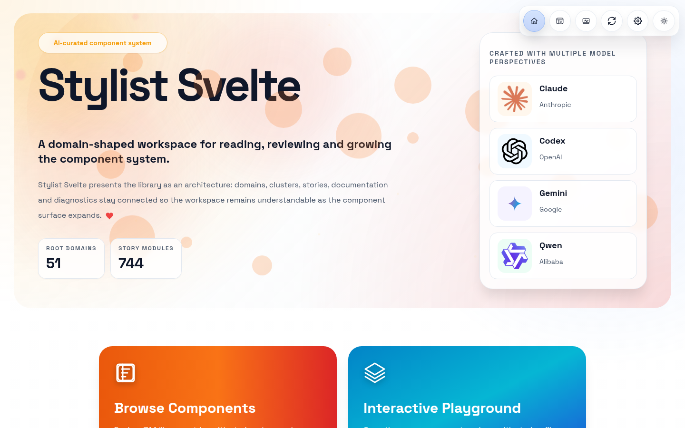
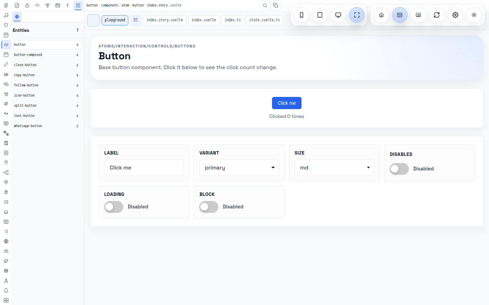
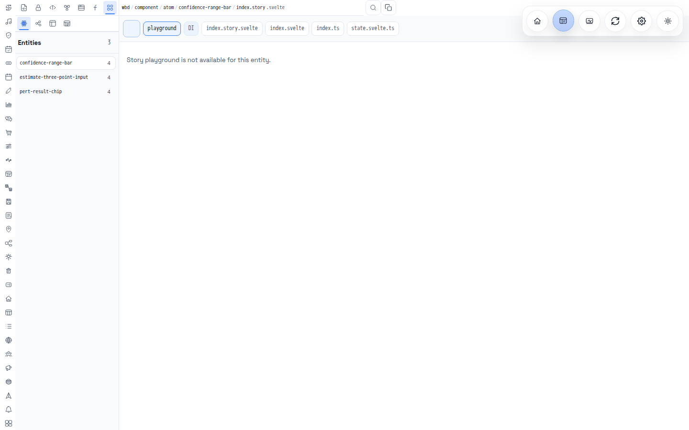
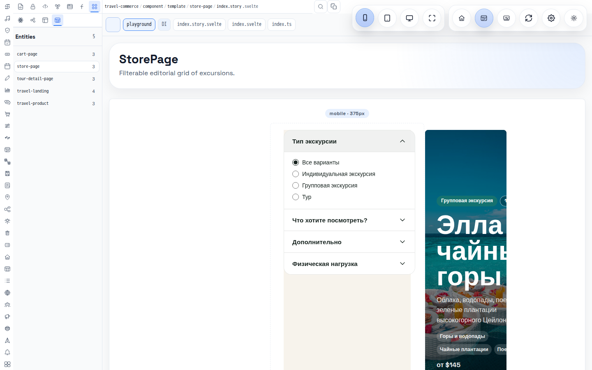
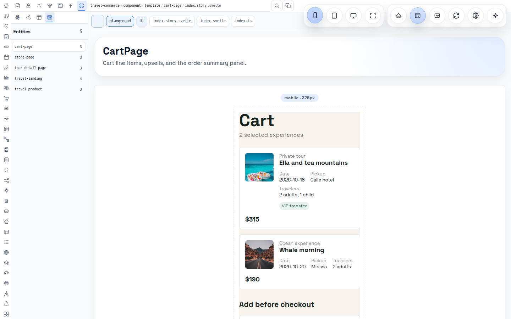

# src/routes — песочница (sandbox)

> Часть ответа на [Godmy/stylist-svelte#1](https://github.com/Godmy/stylist-svelte/issues/1).
> Общая оценка — [`../readme.md`](../readme.md), домены — [`../lib/readme.md`](../lib/readme.md).
>
> Всё ниже проверено на запущенном `yarn dev` (порт 5174) и `yarn build:site` в чистом клоне без
> приватных субмодулей (подготовка — [`experiments/prepare-local-build.sh`](../../experiments/prepare-local-build.sh)).
> Скриншоты сделаны Playwright в окне 1440×900 и лежат в [`docs/screenshots`](../../docs/screenshots).

## 1. Маршруты

| Маршрут                                                                          | Файл                                                                 | Что делает                                                                                                                                                                                                                                                  |
| -------------------------------------------------------------------------------- | -------------------------------------------------------------------- | ----------------------------------------------------------------------------------------------------------------------------------------------------------------------------------------------------------------------------------------------------------- |
| `/`                                                                              | `+page.server.ts` + `+page.svelte`                                   | загружает **весь** манифест (`domain/data/json/domain-page-manifest/index.json`, 2.33 МБ) и рендерит `DomainPlayground` с `initialDomain="wbd"`, `initialCluster="component"`, `initialJoint="atom"`, `initialPreviewMode="story"`                          |
| (layout)                                                                         | `+layout.svelte`                                                     | `ThemeProvider` из `theme/component/atom/theme-provider` + `app.css`                                                                                                                                                                                        |
| `GET /api/content?path=`                                                         | `api/[endpoint]/+server.ts` → `DomainManager.getContentFileResponse` | исходник файла из `src/lib` (лимит `CONTENT_PREVIEW_MAX_FILE_SIZE`); в production читает зеркало `static/generated/lib-source`, которое создаёт только `build:site` (`scripts/generate-lib-source-mirror.mjs`); на Cloudflare — через `platform.env.ASSETS` |
| `GET /api/descriptor?entityPath=`                                                | → `DomainManager.getDomainComponentProjectionResponse`               | проекция дескриптора манифеста                                                                                                                                                                                                                              |
| `GET /api/di?component=&dependency=`                                             | → `DiagnosticManager.getDependencyResponse`                          | DI-дерево; читает `<repoRoot>/stylist/di/output` — **вне репозитория**, в клоне отвечает 404 «DI dependency tree output is not available.»                                                                                                                  |
| `POST /api/*`                                                                    |                                                                      | всегда 405                                                                                                                                                                                                                                                  |
| `GET /api/dashboard/{audit-tree,errors/latest,indexation/latest,reports/latest}` | `api/dashboard/**` → `DashboardManager`                              | отчёты индексатора/аудитора из `<repoRoot>/stylist/*/output` — в клоне пусто (`status: unknown`)                                                                                                                                                            |
| —                                                                                | `app.svelte`                                                         | **не маршрут**: забытый пример темы, импортирует `$stylist` целиком (вместе с `./wbd`, `./geo`)                                                                                                                                                             |
| —                                                                                | `hooks.server.ts`                                                    | `handleError` → `DiagnosticManager.appendErrorLog`                                                                                                                                                                                                          |

Проблемы, найденные при проверке:

- Лендинг ведёт на `/components` и `/playground` (`domain/component/molecule/cta-buttons`,
  `stylist-mission`), а таких маршрутов нет → **404**. Кнопки внутри `DomainPlayground` работают,
  потому что переключают экран в состоянии, а не URL.
- `app.html` ссылается на `favicon.png` → **404**.
- `+page.server.ts` сериализует в HTML весь манифест: ответ `/` = **1 283 378 байт**; первый
  холодный запрос в dev — 18.8 с, тёплый — 0.22 с.

## 2. Как устроен UI песочницы

`DomainPlayground` (`lib/domain/component/page/domain-playground`) — три экрана:

| Экран         | Компонент                   | Содержимое                                                                                                                                               |
| ------------- | --------------------------- | -------------------------------------------------------------------------------------------------------------------------------------------------------- |
| `LANDING`     | `domain-landing`            | hero, счётчики «Root domains 51», «Story modules 744», карточки «Browse Components» / «Interactive Playground»                                           |
| `DOMAIN`      | `domain-explorer` (lazy)    | сам браузер компонентов                                                                                                                                  |
| `DIAGNOSTICS` | `domain-diagnostics` (lazy) | последовательно импортирует и монтирует **каждую** story, меряет `importMs`/`mountMs`, ловит ошибки `import`/`mount`/`window.error`/`unhandledrejection` |

Плавающее меню справа сверху (`domain-menu`): Landing, Components, Diagnostics, Reload manifest
(`window.location.reload()`), Settings (`domain-settings`), переключатель темы. Слева от него —
`device-viewport` (Mobile / Tablet / Desktop / Fullscreen), только на экране `DOMAIN` и только когда
загружена story.



### 2.1 Explorer: меню доменов, переключение кластеров и joint’ов

Сетка `249px | 1fr`. Сайдбар (`domain-sidebar`) состоит из трёх `control/component/molecule/icon-toolbar`
и списка сущностей:

1. **DomainToolbar** — вертикальная колонка из 51 иконки (`showLabel={false}`), подпись только в
   `aria-label`/tooltip.
2. **ClusterToolbar** — горизонтальный ряд из 7 кластеров `DOMAIN_CLUSTER`
   (`data, const, type, interface, class, function, component`); показывается **всегда один и тот же
   набор**, даже если в домене нет такого кластера.
3. **JointToolbar** — joint’ы активного кластера из `JOINT_TOOLBAR_ITEMS` (34 элемента), фильтруются
   по `availableItems`; при отсутствии — «no joints».
4. **DomainList** — сущности (семьи) выбранного joint’а с числом файлов.

Справа: строка таксономии (`taxonomy-breadcrumbs` `domain / cluster / joint / family / file`,
поиск `domain-search`, копирование пути), вкладки режимов (`playground`, `DI`, затем файлы
семьи `index.story.svelte`, `index.svelte`, `index.ts`, `state.svelte.ts`) и область превью
(`domain-file-preview`).

Логика переключения (`domain-explorer/state.svelte.ts`, 520 строк):

- при смене домена/кластера/joint’а `$effect`’ы автоматически выбирают **первый** кластер, joint и сущность;
- у сущности предпочитается `index.story.svelte` → режим `story`; иначе — `index.md` → `markdown`; иначе `file`;
- режимы превью: `file | markdown | story | json-tree | di`;
- исходники грузятся `fetch('/api/content?path=…')`, story — из `import.meta.glob('/src/lib/**/component/**/index.story.svelte')` (lazy).



### 2.2 Что не так в UI (по результатам проверки)



| #   | Проблема                                                                                                                                                                                                     | Где                               | Рекомендация                                                                                                                                          |
| --- | ------------------------------------------------------------------------------------------------------------------------------------------------------------------------------------------------------------ | --------------------------------- | ----------------------------------------------------------------------------------------------------------------------------------------------------- |
| 1   | Стартовый домен — приватный `wbd`. В публичном клоне первое, что видит человек/ИИ, — «Story playground is not available for this entity.»                                                                    | `routes/+page.svelte`             | стартовать с публичного домена (`button`) или с первого домена, у которого есть story на диске                                                        |
| 2   | Домены — 51 иконка без подписей                                                                                                                                                                              | `domain-toolbar`                  | группировать (Фундамент / Ввод / Навигация / Медиа / Бизнес / Продукты — как в `lib/readme.md`) и показывать подписи хотя бы при наведении/расширении |
| 3   | Кластеры показываются статично (7 штук), даже пустые                                                                                                                                                         | `cluster-toolbar`                 | дизейблить/скрывать кластеры, которых нет в `tree` домена, показывать счётчик                                                                         |
| 4   | Список joint’ов в UI ≠ AGENTS.md: в UI есть `enum`, `set`, `struct`, `yaml`, но нет `async-get`, `async-post`, `create`, `resolve`, `serialize`, `compute`, `flag`, `icon`, `png`, `jsonl`                   | `JOINT_TOOLBAR_ITEMS`             | генерировать список из того же источника, что и линтер таксономии                                                                                     |
| 5   | Вкладка Markdown ищет `index.md`, а на диске 0 `index.md` и 5 `readme.md`                                                                                                                                    | `state.svelte.ts:100,355`         | искать `readme.md` (или привести AGENTS.md и файлы к одному имени)                                                                                    |
| 6   | Выбор не отражается в URL — нельзя дать ссылку на компонент, нельзя открыть story из теста/скрипта                                                                                                           | `state.svelte.ts`                 | `?d=button&c=component&j=atom&f=button&m=story&device=mobile` или маршрут `/[domain]/[cluster]/[joint]/[family]`                                      |
| 7   | Выбор результата поиска всегда переключает в режим `file`, даже если есть story                                                                                                                              | `selectSearchEntry`               | использовать ту же логику предпочтения story, что и при выборе сущности                                                                               |
| 8   | `state.svelte.ts` объявляет свои копии `DomainTreeNode` и т. п. вместо `domain/type/object/*`                                                                                                                | `domain-explorer/state.svelte.ts` | импортировать типы домена (одно определение — одно место)                                                                                             |
| 9   | Манифест устарел: в `button/component/atom` UI показывает 9 сущностей, на диске 16 (нет `animated-button`, `arrow-button`, `fill-button`, `glow-button`, `morph-button`, `selection-button`, `shine-button`) | манифест                          | пересобирать манифест в CI; либо строить дерево из `import.meta.glob` при сборке                                                                      |
| 10  | Плавающая панель device switcher перекрывает правую часть строки вкладок файлов                                                                                                                              | `domain-playground`               | встроить switcher в шапку превью                                                                                                                      |
| 11  | Ссылки `/components`, `/playground` ведут на 404, нет `favicon.png`                                                                                                                                          | см. раздел 1                      | добавить маршруты или поменять `href`                                                                                                                 |

## 3. Организация `index.story.svelte` и влияние на старт сервера

### 3.1 Как сейчас

- 658 файлов `index.story.svelte` (+ 744 по манифесту вместе с приватными), 637 используют
  `theme/component/molecule/story` (`Story`), 487 — `SlotStory` для controls.
- Explorer подключает их через `import.meta.glob(..., lazy)` → каждая story — отдельный динамический чанк
  (в `build:site` получилось **1685** клиентских JS-чанков). В dev Vite трансформирует story только при
  открытии, поэтому старт dev-сервера быстрый (≈6 с «ready»), а платим мы на первом запросе к `/`
  (18.8 с — SSR + оптимизация зависимостей + 1.28 МБ манифеста).
- `domain-diagnostics` делает **второй** `import.meta.glob('/src/lib/**/component/**/*.story.svelte')`
  (маска шире — `*.story.svelte`); при сборке это ещё один граф из тех же 700+ модулей.
- Stories не изолированы от тяжёлых данных: `graph/component/organism/zwicky-scene/index.story.svelte`
  импортирует 1.19 МБ JSON через `?url` — и именно эта story ломает сборку, потому что JSON удалён.
- `controls` типизированы слабо: `Snippet<[Record<string, unknown>]>` → в 512 story-файлах
  `values: any` / `as any`.

### 3.2 Критика

1. **Два источника правды о stories** — `glob` и `storyModulePath` в манифесте. Они уже разошлись
   (7 кнопок есть в glob, нет в манифесте). Песочница может «знать» story, которую не показывает.
2. **Одна ошибка в любой story валит всю сборку песочницы** (glob → все stories в одном графе).
3. Stories смешивают демо-данные, разметку и controls: нет общего формата «args», поэтому их нельзя
   переиспользовать в тестах и скриншотах без монтирования всего `Story`.
4. `Story` живёт в `theme` → каждая story тянет домен `theme`; изменение `Story` пересобирает всё.

### 3.3 Рекомендации

1. **Один источник:** манифест генерируется из файловой системы в CI, а explorer использует
   `storyModulePath` из манифеста как ключ в glob; glob остаётся только как «загрузчик».
2. **Разделить манифест:** `tree.json` (несколько десятков КБ — имена доменов/кластеров/joint’ов/семей)
   отдаётся в SSR; `descriptors/<domain>.json` подгружается по требованию при входе в домен. Это
   уберёт 1.28 МБ из HTML и сократит холодный старт.
3. **Типизированные stories:** `Story<TArgs>` + `controls: SlotStory<TArgs>[]`, `children: Snippet<[TArgs]>`;
   экспорт `args`/`variants` из `index.story.svelte` через `<script module>` — их смогут читать тесты,
   скриншот-раннер и ИИ без монтирования.
4. **Тяжёлые данные — не в граф модулей:** JSON > 100 КБ класть в `static/` и грузить `fetch`’ем,
   либо в `data/json` с ленивым `import()` внутри `onMount`.
5. **Изоляция ошибок сборки:** в CI отдельный шаг «собрать каждую story» (`vite build` c одной
   точкой входа или `svelte-check` по stories), чтобы сломанная story называлась по имени, а не
   роняла весь `build:site`.
6. **Один glob** в общем модуле (`domain/function/script/story-modules`), который используют и explorer,
   и diagnostics, с одинаковой маской.
7. Вынести `Story`/`SlotStory` из `theme` в `domain` (или отдельный домен `story`).

## 4. Влияние манифеста

`domain/data/json/domain-page-manifest/index.json` — 2.33 МБ: `tree` (51 домен) + 779 `descriptors`
(`entityPath`, `domain/cluster/joint/family`, `componentModulePath`, `recipeTypePath`,
`stateFunctionPath`, `componentStatePath`, `storyModulePath`, `hasRecipePipeline`,
`hasStatePipeline`, `hasStoryPreview`, массивы `*JsonPaths`).

| Где используется              | Эффект                                                                                        |
| ----------------------------- | --------------------------------------------------------------------------------------------- |
| `routes/+page.server.ts`      | весь файл сериализуется в HTML → 1.28 МБ на каждый заход на `/`, парсинг на клиенте, гидрация |
| `server/class/manager/domain` | импортируется ещё раз в серверный бандл (`/api/descriptor`)                                   |
| `domain-playground`           | из `descriptors` берётся только `storyModuleCount` (число на лендинге)                        |
| explorer                      | использует `tree` для навигации — т. е. 779 дескрипторов на клиенте почти не нужны            |
| сборка                        | JSON целиком попадает и в серверный, и в клиентский граф                                      |

Выводы:

- Манифест — правильная идея (машинно-читаемая карта библиотеки, база для ИИ), но сейчас это
  **кэш, который не инвалидируется**: генерируется внешним Python-индексатором автора, в CI не
  проверяется, уже отстаёт от диска.
- Кнопка «Reload manifest» просто перезагружает страницу — нового манифеста она не получит, пока его
  не перегенерирует внешний инструмент.
- Рекомендация: Node-скрипт `scripts/generate-domain-manifest.mjs` в репозитории, шаг в CI
  `generate && git diff --exit-code`, разделение на `tree` + `descriptors/<domain>.json`, отдача
  дескрипторов через уже существующий `/api/descriptor`.

## 5. Device switcher: как сейчас и что дальше

### 5.1 Как работает сейчас

`domain/component/molecule/device-viewport` → `ManagerStoryViewportContext` → `Story`
(`theme/component/molecule/story`) применяет к `.component-preview__surface` `max-width`
(mobile 375px, tablet 768px, desktop 1440px, fullscreen — без ограничения) и `container-type: inline-size`.

Проверено в браузере (окно 1440×900, режим Mobile):

```js
matchMedia('(max-width: 980px)').matches; // false
document.querySelector('.component-preview__surface').getBoundingClientRect().width; // 375
getComputedStyle(surface).containerType; // "inline-size"
```

Т. е. **`@media` по-прежнему видит окно 1440px**, а `@container` — 375px. В библиотеке 367 правил
`@media` в 125 компонентах и только 43 `@container` в 32. Наглядно:

| `travel-commerce/component/template/store-page` — только `@media (max-width: 980px)`                                                  | `travel-commerce/component/template/cart-page` — `@media` **и** `@container`                                                |
| ------------------------------------------------------------------------------------------------------------------------------------- | --------------------------------------------------------------------------------------------------------------------------- |
|  |  |

Ещё одна деталь: в режиме Desktop (1440px) поверхность фактически получает **1109px** — ширину
области превью при окне 1440×900 (сайдбар 249px + отступы), т. е. Desktop от Fullscreen не
отличается, а настоящие 1440px увидеть нельзя.

Автор уже знает о проблеме — в `cart-page/index.svelte` есть комментарий «Duplicated as `@media`
(real device viewport) and `@container` … Keep both in sync». Ручная синхронизация двух копий правил
на 125 компонентах — источник ошибок.

Кроме того, в домене уже есть `domain/component/organism/device-frame` (рамки iPhone SE 375×667,
iPad 768×1024, монитор 1440×900, ориентация), но песочница его **не использует** — только его
собственная story.

### 5.2 Предлагаемое будущее device switcher’а

1. **Изолированный маршрут превью** `/preview/[...entity]` (или `/preview?path=…`), который рендерит
   одну story без оболочки песочницы. Explorer показывает его в `<iframe>` нужной ширины/высоты →
   `@media`, `vh`, `dvh`, `pointer: coarse`, `prefers-*` работают честно. Это же основа для
   скриншотов (раздел 6) и для открытия story в новой вкладке.
2. **Два режима:** «Container» (как сейчас — быстро, для атомов/молекул) и «Device» (iframe — для
   организмов/шаблонов/страниц). По умолчанию выбирать по joint’у: `template`/`page` → Device.
3. **Использовать `device-frame`** вокруг iframe: рамка, ориентация (portrait/landscape), safe-area.
4. **Произвольный размер:** поля ширина×высота, drag-ручки по краям, пресеты (320, 360, 375, 390,
   414, 768, 834, 1024, 1280, 1440, 1920), пользовательские пресеты в `localStorage`.
5. **Масштаб (zoom)** — чтобы 1920px помещался в 1100px области превью (`transform: scale` iframe).
6. **DPR/touch-эмуляция** в рамках возможного в браузере; для честной эмуляции — Playwright (раздел 6).
7. **Сравнение рядом:** mobile | tablet | desktop одновременно (три iframe) — сразу видно поведение
   брейкпоинтов.
8. **Синхронизация с URL** (`&device=mobile&w=375&h=667&zoom=0.8&theme=dark`).
9. **Линтер адаптивности:** предупреждение в диагностике, если компонент уровня atom/molecule/organism
   использует `@media` без `@container` (правило: компоненты — `@container`, шаблоны/страницы — `@media`).
10. Плавающую панель switcher’а встроить в шапку превью, чтобы она не перекрывала вкладки файлов.

## 6. Скриншоты компонентов на произвольном экране и передача ИИ

Цель из issue: снимать компонент на любом экране и отдавать снимок ИИ, чтобы он улучшал визуал.

### 6.1 Что уже есть и на чём строить

- `domain-diagnostics` уже умеет пройти по всем stories, импортировать и смонтировать каждую и
  собрать ошибки/время — не хватает только снимка.
- `canvas/component/molecule/screenshot-selector` — выбор области на экране (можно использовать для
  «снять фрагмент»).
- Манифест знает `storyModulePath`, `recipeTypePath`, `componentModulePath` для каждой сущности —
  это контекст, который нужно отдавать ИИ вместе с картинкой.

### 6.2 Предлагаемые функции

1. **Маршрут `/preview/[...entity]`** (см. 5.2) с параметрами `device`, `w`, `h`, `theme`,
   `variant`, `args` (base64-JSON значений controls). Без оболочки песочницы → стабильный снимок.
2. **Кнопка «Снимок» в explorer’е** — клиентский снимок текущего превью (SVG `foreignObject` →
   canvas, без внешних зависимостей) или запрос к серверу (п. 3) за «честным» снимком. Результат:
   PNG + копирование в буфер, чтобы вставить в чат с ИИ.
3. **Серверный раннер (dev-only) `scripts/capture-stories.mjs`** на Playwright (уже доступен как
   dev-инструмент): читает манифест, для каждой сущности × устройства × темы открывает
   `/preview/…`, ждёт `document.fonts.ready` + отсутствие анимаций (`prefers-reduced-motion: reduce`),
   делает `page.screenshot()`; сохраняет в `artifacts/screenshots/<domain>/<cluster>/<joint>/<family>/<device>-<theme>.png`.
4. **Пакет контекста для ИИ** рядом с PNG — `context.json`:
   `{ entityPath, device: {w,h,dpr}, theme, args, recipe (текст интерфейса), story (исходник),
component (исходник), consoleErrors, a11y (axe-core нарушения), layoutIssues (горизонтальный
скролл, элементы за пределами viewport, перекрытия, текст < 12px, контраст) }`.
   Именно автоматические `layoutIssues` позволяют ИИ понять, что исправлять, а не гадать по картинке.
   Пример (измерено скриптом ниже): `store-page` в режиме Mobile — поверхность 375px, `scrollWidth`
   582px, 56 элементов за её пределами; `cart-page` — 375/373px, 0 элементов.
5. **Визуальный регресс:** сравнение с эталоном (`pixelmatch`-подобный diff) → только изменившиеся
   компоненты уходят на ревью ИИ/человеку; эталоны — в отдельной ветке/артефактах CI, не в основном репо.
6. **Цикл улучшения:** `capture → ИИ-оценка по чек-листу (MD3: отступы, иерархия, контраст,
выравнивание, состояния hover/focus/disabled) → issue/PR с правкой → повторный capture → diff`.
   Это и есть «Hive Mind»-контур: множество агентов параллельно берут домены из манифеста.
7. **MCP-инструмент** `screenshot(entityPath, device, theme, args)` поверх того же раннера — любой
   агент (Claude, Codex, Gemini, Qwen — их логотипы уже на лендинге) может сам посмотреть результат
   своей правки.
8. **Снимки состояний:** для каждого варианта (`variants`) и для `:hover`/`:focus-visible`/`disabled`
   (Playwright `hover()`/`focus()`), тёмная/светлая тема, `rtl`.

Минимальный рабочий прототип такого раннера (через UI explorer’а, пока нет `/preview`) —
[`examples/capture-story-screenshots.mjs`](../../examples/capture-story-screenshots.mjs):

```bash
yarn dev   # в отдельном терминале
NODE_PATH="$(npm root -g)" node examples/capture-story-screenshots.mjs --out artifacts/screenshots \
  travel-commerce/component/template/store-page travel-commerce/component/template/cart-page
# travel-commerce/component/template/store-page Mobile: surface 375px, scrollWidth 582px, 56 overflowing elements
# travel-commerce/component/template/cart-page Mobile: surface 375px, scrollWidth 373px, 0 overflowing elements
```

Для каждого устройства он пишет `<device>.png` и `<device>.context.json` (размеры, переполнение,
мелкий текст, ошибки консоли, исходники компонента и story) — готовый пакет для модели.

## 7. Приоритетный план для песочницы

1. Стартовать с публичного домена; убрать 404 (`/components`, `/playground`, `favicon.png`).
2. Состояние в URL + маршрут `/preview/[...entity]`.
3. Разделить манифест (tree в SSR, descriptors по требованию) и генерировать его в CI.
4. Iframe-режим device switcher’а + `device-frame` + произвольные размеры.
5. Скриншот-раннер + `context.json` + визуальный регресс в CI.
6. Типизированные stories (`Story<TArgs>`), один общий glob, `readme.md` в Markdown-вкладке.
